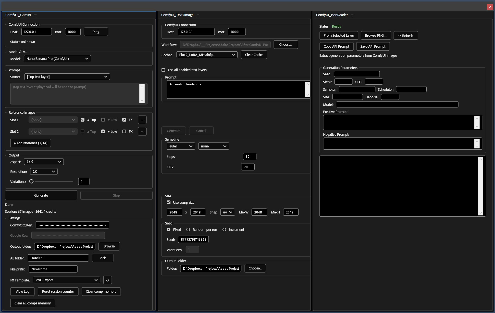
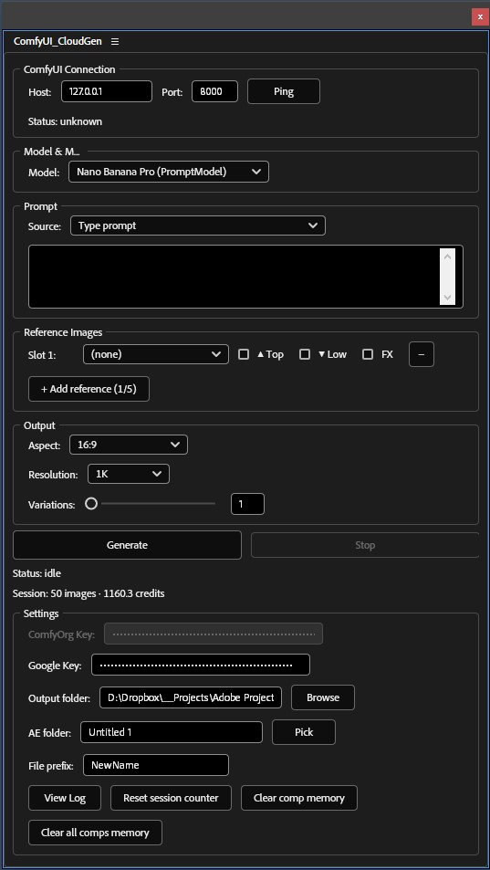

# **AE-ComfyUI-Panels**

Adobe After Effects → ComfyUI generative workflow

A set of After Effects ScriptUI panels that connect directly with ComfyUI.
Send prompts or selected layers from AE, generate images through your ComfyUI workflow, and automatically import the results back into your composition.
For cloud-based generation, the CloudGen panel routes prompts and reference images to Google Gemini through ComfyUI — no local GPU required.
A streamlined AI-enhanced pipeline for motion graphics and design.

---

## 🎬 **Demo**

[](https://youtu.be/COzt2UDgLn4)

*Text2Image and JSON Reader demo and usecases*

---

## 📦 **Download**

**[⬇ Download latest release (v1.0.0)](https://github.com/ckonteos80/Adobe-After-Effects-ComfyUI-Panels/releases/tag/v1.0.0)**

---

## 🧠 **Concept**

These panels bridge **Adobe After Effects** and **ComfyUI**, enabling a smooth AI-generation workflow without leaving AE.
Depending on the panel, AE can:

1. Send a **text prompt** to ComfyUI (Text2Image),
2. Or send a **selected image layer** (Image2Image),
3. Process it using your ComfyUI workflow,
4. Retrieve the generated output into the AE project,
5. Optionally read JSON metadata (seed, settings, etc.) for reproducible generation.

6. Or route to **Google Gemini via ComfyUI** (CloudGen) — billed via ComfyUI credits or Google AI API key depending on model variant, no local GPU required.

This lets you build hybrid pipelines combining AE animation with AI-driven visuals.

---

## ✨ **Features**

### Text 2 Image Panel (Open Source Models)
* Generate AI images from text prompts without leaving After Effects
* **Text Layer Batch Mode** — automatically generate one image per enabled text layer in the active comp
* **Batch Variations** — generate multiple images per prompt with Fixed, Random, or Increment seed modes
* **Workflow Caching** — instant loading of previously used workflows with automatic cache invalidation
* **API Introspection** — dynamically loads available samplers and schedulers from your ComfyUI instance
* **Current Value Extraction** — pre-populates UI with the workflow's existing parameter values
* Full parameter control: resolution, steps, CFG, sampler, scheduler, denoise, seed
* Positive & negative prompt support (shown only when the workflow supports it)
* Automatic import of generated images into your AE project


### Google Gemini (Nano Banana)
* Generate images via Google Gemini (Nano Banana / Nano Banana Pro) through a local ComfyUI instance
* **No local GPU required** — billed via ComfyUI credits (platform.comfy.org) for ComfyUI-variant models, or via Google AI API key for PromptModel variants
* **4 model variants** — Nano Banana and Nano Banana Pro, each available as a ComfyUI-credit node or a Google-API-key PromptModel node
* **Text-to-Image and Image-to-Image** — mode auto-detected from active reference slots
* **Up to 14 reference image slots** — assign specific layers or use dynamic Top/Lowest layer tracking
* **Edited Image References** — Apply effects on layers and use them as image references.
* **Precompositions as References** — use precomp layers as references.
* **Composition-aware planner** — auto-segments work area by text+image layer transitions and generates one batch per unique segment
* **Cost confirmation dialog** — review all planned jobs and estimated credit cost before submitting
* **Per-composition memory** — model, slots, and settings saved and restored per comp
* Automatic import of generated images timed to their composition segment
* Pure ExtendScript — no external dependencies


### Image 2 Image Panel *(work in progress)*
* Transform any image layer in your composition using Open source models.
* **Smart Source Selection** — pick any image layer, with optional render-with-effects support
* **Batch Variations** — seed increment and denoise progression in a single run
* Full parameter control: denoise, steps, CFG, sampler, scheduler, seed, resolution
* Automatic import of generated images into your AE project

### JSON Reader Panel
* **Instant Metadata Reading** — fast PNG chunk parsing extracts ComfyUI data in milliseconds
* Extracts seed, steps, CFG, sampler, scheduler, size, denoise, model, and prompts
* **Flux Support** — reads Flux.1 and Flux.2 workflow parameters
* **Copy / Save API Prompt** — export the full API-format JSON for reuse or resubmission
* **Layer Integration** — read metadata directly from a selected footage layer in the active comp
* **Auto-Refresh** — updates automatically when you select a different layer
* No external dependencies — pure ExtendScript

---

## 📁 **Folder Structure**

```
AE-ComfyUI-Panels/
├── Text2Image/        # Text-to-image panel code
│   └── API/           # Ready-to-use ComfyUI API workflow JSONs
├── Image2Image/       # Image-to-image panel code
├── JsonReader/        # JSON metadata reader panel
├── Gemini/            # CloudGen panel — Gemini via ComfyUI
├── Screenshots/       # UI & workflow reference images
├── .gitignore
└── LICENSE
```

---

## 🖥️ **Requirements**

* Adobe After Effects CC 2018 or newer
* [ComfyUI](https://github.com/comfyanonymous/ComfyUI) running locally or on the network (default: `127.0.0.1:8188`)
* A ComfyUI API-format workflow JSON file
* A ComfyUI credits account at [platform.comfy.org](https://platform.comfy.org) — for ComfyUI-variant Gemini models *(CloudGen panel only)*
* A Google AI API key — for PromptModel-variant Gemini models *(CloudGen panel only)*

---

## ⚙️ **Installation**

1. Download or clone the repo:

   ```
   git clone https://github.com/ckonteos80/AE-ComfyUI-Panels.git
   ```

2. In After Effects, go to **File → Scripts → Install ScriptUI Panel...**

3. Select the `.jsx` file for the panel you want to install and click **Open**

4. Restart After Effects

5. Open the panel via **Window → ComfyUI_Text2Image.jsx** (or the respective panel name)

> **Note:** Enable script access if prompted:
> **Edit → Preferences → Scripting & Expressions → Allow Scripts To Write Files And Access Network**

---

## ▶️ **Usage**

### **Text-to-Image** — [full docs](Text2Image/README.md)

1. Start ComfyUI with your desired model loaded
2. Open the panel via **Window → ComfyUI_Text2Image.jsx**
3. Set host/port and choose a workflow JSON
4. Enter your prompt (or enable **Use all enabled text layers** for batch mode)
5. Adjust parameters and click **Generate**
6. Results are automatically imported into your AE project

### **Image-to-Image** — [full docs](Image2Image/README.md) *(work in progress)*

1. Select an image layer in your composition
2. Open the panel via **Window → ComfyUI_Image2Image.jsx**
3. Choose a workflow JSON, adjust parameters
4. Click **Generate** — result appears as a new imported layer

### **JSON Reader** — [full docs](JsonReader/README.md)

1. Import a ComfyUI PNG into your project and add it to a composition
2. Select the footage layer in the timeline
3. Open the panel via **Window → ComfyUI_JsonReader.jsx**
4. Click **From Selected Layer** — all generation parameters are displayed instantly
5. Use **Copy API Prompt** or **Save API Prompt** to export the JSON for reuse

### **CloudGen (Google Gemini)** — [full docs](Gemini/README.md)

1. Start ComfyUI and open the panel via **Window → ComfyUI_Gemini.jsx**
2. Set host/port and enter your API key in Settings — **ComfyOrg Key** for ComfyUI-variant models, **Google Key** for PromptModel variants
3. Choose a Gemini model, set your prompt source, and optionally add reference image slots
4. Set aspect ratio, resolution, and variations, then click **Generate**
5. Review the cost confirmation dialog and confirm
6. Results are imported and placed in the timeline at the correct time range

---

## 🗂️ **Example Workflows**

Ready-to-use API-format workflow JSONs are included in [`Text2Image/API/`](Text2Image/API/):

| File | Model Family | Notes |
|------|-------------|-------|
| [Flux1_LoRA.json](Text2Image/API/Flux1_LoRA.json) | Flux.1 + LoRA | `KSampler` + `CLIPTextEncodeFlux` |
| [Flux1_no_LoRA.json](Text2Image/API/Flux1_no_LoRA.json) | Flux.1 | `KSampler` + `CLIPTextEncodeFlux` |
| [Flux2_LoRA.json](Text2Image/API/Flux2_LoRA.json) | Flux.2 + LoRA | `SamplerCustomAdvanced` |
| [Flux2_NoLoRA.json](Text2Image/API/Flux2_NoLoRA.json) | Flux.2 | `SamplerCustomAdvanced` |
| [Flux2_Image_Reference.json](Text2Image/API/Flux2_Image_Reference.json) | Flux.2 image-reference | `SamplerCustomAdvanced` |
| [hidream_i1_full.json](Text2Image/API/hidream_i1_full.json) | HiDream i1 | — |
| [qwen_image_illustration_lora.json](Text2Image/API/qwen_image_illustration_lora.json) | Qwen Image + LoRA | Positive + negative prompts |

All files are exported in **API format** from ComfyUI (not the UI/graph format).

---

## 🚧 **Roadmap**

* Live preview inside panel
* Multi-image return support
* Optional AE project template

---

## 📸 **Screenshots**


*Left to right: Text2Image, Image2Image, JSON Reader*


*CloudGen — Google Gemini image generation via ComfyUI*

---

## 📜 **License**

MIT License — free for commercial and non-commercial use.

---

## 👤 **Author**

Created by **@ckonteos80**
Contributions and pull requests welcome.
